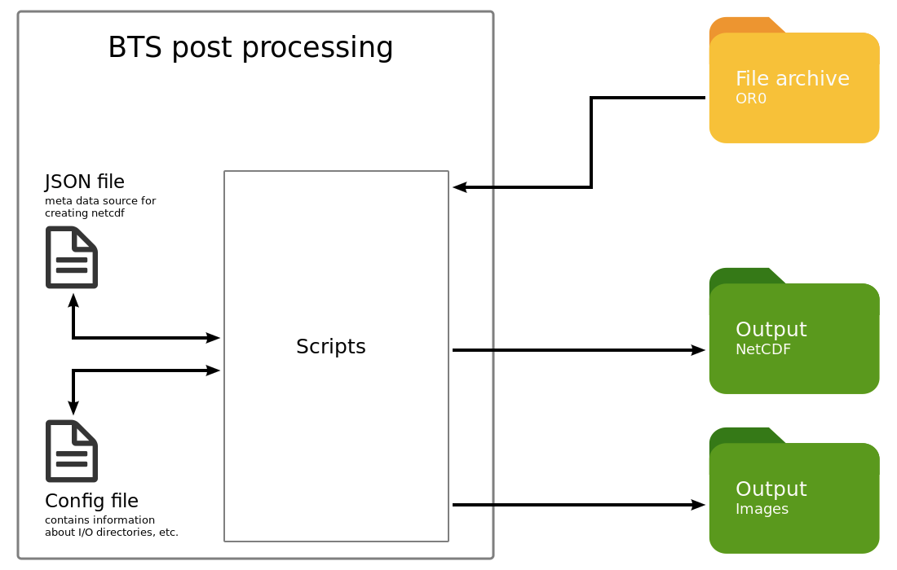

# Data import and processing of SOLARSCAN OR0-files
[](https://creativecommons.org/licenses/by-sa/4.0/)

The repository contains post-processing scripts to read and visualize solar radiation data exported by the  "Solarscan Software System" (hereinafter referred as Solarscan).


## Description
### General issue
The spectroradiometer BTS2048 is currently operated via a Solarscan. Solarscan is responsible for the a continuous scheduling and the measurement and the radiometric calibration of the BTS2048. Solarscan exports it's data in a specific ASCII-Format, see also [Solarscan User Manual](doc/Solarscan_BTS2048.pdf).

The used file format of the Solarscan export is not well documented. However, the data should be archived in a well documented file format, which will be used of a majority of the Earth science community. The scripts of that repository will take account of this.

### Objectives
The software package is written to post-process observed solar radiation data of the array spectroradiometer BTS2018.
The software package includes
* a module to read OR0-Files from UV observations stred in Solarscan format and
* a module to visualize the numerical data and
* a module to store data as netcdf file(s)
* a module to visualize data gaps.

### Assumption
* the OR0-Files should fits the naming pattern "`<IDYYMMDD>.OR0`", where
  * **ID** is a character string with a length of two and respresents a identifier of the UV station
  * and **YY** year since 2000, **MM** number of month, **DD** day of the month (all filled with zeros)
* the OR0-Files are in following directory structure "`<YYYY/MM/DD/>`", where
  * and **YYYY** year, **MM** number of month, **DD** day of the month (all filled with zeros)

### Scheme


## Requirements

* Python version 3.x
* argparse
* calendar
* datetime
* matplotlib
* NetCDF
* numpy
* os
* pygal
* configparser
 
## Usage
```
# example to create netCDF files and images
cd src

./BTS_main_process.py -n -i -s 20190101 -e 20190102


optional arguments:
  -h, --help         show this help message and exit
  -s ID              Insert the initial date as 20190107(y:2019 m:01 d:07)
  -e FD              Insert the final date as 20190107(y:2019 m:01 d:07)
  -i, --image        create images files
  -n, --netcdf       create netCDF files
  -st, --statistics  create statistics of missing files !! Submodule required, see Requirements 2 !!

``` 
## Requirements 2
To generate plots about the statistics of missing files in your archiv you have to implement a further python module as git submodule.
```
# go to root directory of the current main repo

# Add submodule repository
$ git submodule add <repository> <path>
$ git submodule add https://github.com/rico-hengst/tropos.heatmap_missing_files src/Submodule

# notice the modification to your main repository
$ git status -s
A  .gitmodules
A  src/Submodule
$ git commit "added submodule"

# Init submodule and get content from the repository
$ git submodule update --init

```
... to embedding external git repositories in the current repository.

* [vogella.com](https://www.vogella.com/tutorials/GitSubmodules/article.html)
* [ralfebert.de](https://www.ralfebert.de/git/submodules/)

## License
[CC BY-SA 4.0 ](https://creativecommons.org/licenses/by-sa/4.0/)

Logos, icons and the Solarscan User manual are not affected by the license of this repository.


## Authors
* Rico Hengst  [https://orcid.org/0000-0001-8994-5868](https://orcid.org/0000-0001-8994-5868)
* Nicolas Bayer
* Lionel Doppler  [https://orcid.org/0000-0003-3162-8602](https://orcid.org/0000-0003-3162-8602)

## Cooperation


## ToDo
* improve script to read, plot auxiliary data


