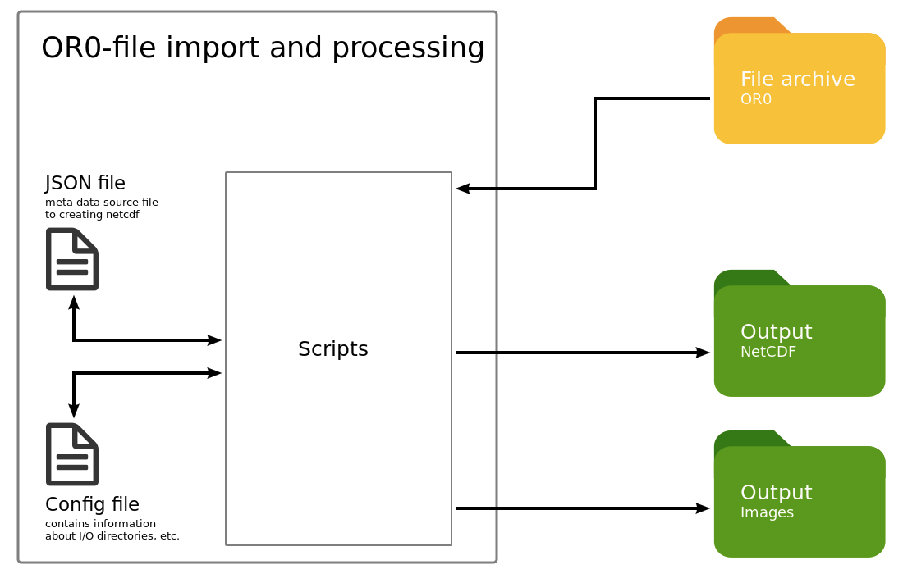

# Data import and processing of SOLARSCAN OR0-files
[](https://www.gnu.org/licenses/gpl-3.0)

The repository contains post-processing scripts to read and visualize solar radiation data exported by the  "Solarscan Software System" (hereinafter referred as Solarscan).


## Description
### General issue
The spectroradiometer BTS2048 is currently operated via a Solarscan. Solarscan is responsible for the a continuous scheduling and the measurement and the radiometric calibration of the BTS2048. Solarscan exports it's data in a ASCII-Format, which is not specifed until now.

The used file format of the Solarscan export is not well documented. However, the data should be archived in a well documented file format, which will be used of a majority of the Earth science community. The scripts of that repository will take account of this.

### Objectives
The software package is written to post-process observed solar radiation data of the array spectroradiometer BTS2018.
The software package includes
* a module to read OR0-Files from UV observations stored in Solarscan format and
* a module to visualize the numerical data and
* a module to store data as netcdf file(s)
* a switch to visualize data gaps (missing files).

### Assumption
**Filename:** the OR0-Files should fits the naming pattern "`<IDYYMMDD>.OR0`", where
  * **ID** is a character string with a length of two and respresents a identifier of the UV station
  * and **YY** year since 2000, **MM** number of month, **DD** day of the month (all filled with zeros)

### Scheme


## Requirements

* Python version 3.7 >=
* pip install git+https://github.com/hdeneke/trosat-base
* required python packages, see file [requirements.txt](requirements.txt).
* see code below to install required python packages

```bash
## via conda
conda install --file requirements.txt
# via pip
pip install -r requirements.txt
```

<!--
## Requirements 2 (optional)
To generate plots about the statistics of **missing data** in your archiv you have to implement a further python module [github.com/rico-hengst/tropos.heatmap_missing_files](https://github.com/rico-hengst/tropos.heatmap_missing_files) from as git submodule.
```
# go to root directory of the current main repo

# Already done during implementation of submodule
# Add submodule repository
$ git submodule add <repository> <path>
$ git submodule add https://github.com/rico-hengst/tropos.heatmap_missing_files src/Submodule

# Already done during implementation of submodule
# notice the modification to your main repository
$ git status -s
A  .gitmodules
A  src/Submodule
$ git commit "added submodule"


# Last step is always required to get updates
# Init submodule and get content from the repository
$ git submodule update --init

```
... to embedding external git repositories in the current repository.

* [vogella.com](https://www.vogella.com/tutorials/GitSubmodules/article.html)
* [ralfebert.de](https://www.ralfebert.de/git/submodules/)

-->
## Installation

**Option 1 - manual download and install**

You can get a local clone of the current software repository and install via:
```bash
git clone https://github.com/rico-hengst/tropos.sat.uv-spectroradiometer.data_processing.git ~/tmp/uv/

cd ~/tmp/uv
python setup.py install
```

**Option 2 - install via pip**

You can install the software via:
```bash
pip install git+https://github.com/rico-hengst/tropos.sat.uv-spectroradiometer.data_processing.git
```

**Uninstall**

To uninstall the software, please use:
```bash
pip uninstall TODO
```


## Configuration
When using this software code for the first time, we would like to recommend to configure the code in the suggested way.

The software has two configuration files, which are available here as templates:  [config.ini](src/config/templates/config.ini) and [uv_js_meta.json](src/config/templates/uv_js_meta.json).

To execute the software faultless, a **local adaption of ```config.ini``` with your preferences is necessary**.
A local adaption of ```uv_js_meta.json``` is optinal. Adjustments of this file can affect the funtionality of the script. In case of editing this file, be carefully.

**Local configuration**

1. create a local configuration directory

```bash
LOCAL_UV_CONFIG_DIR=~/.uvconfig/
mkdir $LOCAL_UV_CONFIG_DIR
```
2. find your installed configuration files, here only ```config.ini```

```bash
pip show tropos_uv | grep "Location: " | sed -e 's/^Location: //g' | xargs -n 1 bash -c 'ls ${1}/tropos_uv/config/templates/config.ini' args

# store template path to variable
CONFIG_TEMPLATE=$(pip show tropos_uv | grep "Location: " | sed -e 's/^Location: //g' | xargs -n 1 bash -c 'ls ${1}/tropos_uv/config/templates/config.ini' args)
```

3. copy the template configuration file to your local configuration directory

```bash
cp $CONFIG_TEMPLATE $LOCAL_UV_CONFIG_DIR
```

4. please edit and **customize** your local configuration file (ini-format) with your preferred editor

```bash
editor "${LOCAL_UV_CONFIG_DIR}config.ini"
```

5. further remarks about the content of ```config.ini```
  * section [PATHFILE] configures the data file structure of your local file system, about path of your UV data and path, where the processed should be stored
  * section [STATION] provides metadata of the location, where the measurements were made (e.g: station_prefix is the used prefix in the filename exported by SolarScan)
  * section [INSTRUMENT] provides metadata about the instrument
  * section [TIMEZONE] provides information about timezones

Now the configuration is done.


## Usage
This python software package provides a console script for easy and simple execution.
If the installation of this package and if the configuration are finished, the execution of the console script can be tackled.

A logging framework is implemented. So logging messages will be collected, appended and published via screen and via logfile.

* required parameters
  * ```-s``` and ```-e``` (start and end date of data processing)
  * ```--configfile``` (path and filename of your local configuration)
* recommended parameter
  * ```--logfile``` (path and filename of a file, where the logging information will be appended)
  * ```-n``` and/or ```-i``` (specify the aim of the script execution, process netCDF, process image)

Show help of the console script:


```bash
$ process_uv_bts -h

  optional arguments:
    -h, --help            show this help message and exit
    -s ID                 processing start date as 20190107 (y:2019 m:01 d:07)
    -e FD                 processing end date as 20190107 (y:2019 m:01 d:07)
    --configfile YOUR_CONFIG_FILE
                          config path and file name
    -i, --image           switch to create images files
    -n, --netcdf          switch to create netCDF files
    --loglevel LOGLEVEL   define loglevel to output screen INFO (default) |
                          WARNING | ERROR
    --logfile LOGFILE     define logfile
    --jsonfile JSONFILE   define jsonfile
```

Execute the console script:
```bash
# example to create netCDF files and images
process_uv_bts -n -i -s 20190101 -e 20190102 --configfile ~/.uvconfig/config.ini --logfile ~/.uvconfig/uv_processing.log
```

## License
[](https://www.gnu.org/licenses/gpl-3.0)

Logos, icons and the Solarscan User manual are not affected by the license of this repository.


## Authors
* Rico Hengst  [https://orcid.org/0000-0001-8994-5868](https://orcid.org/0000-0001-8994-5868)
* Nicolas Bayer
* Lionel Doppler  [https://orcid.org/0000-0003-3162-8602](https://orcid.org/0000-0003-3162-8602)

## Cooperation


